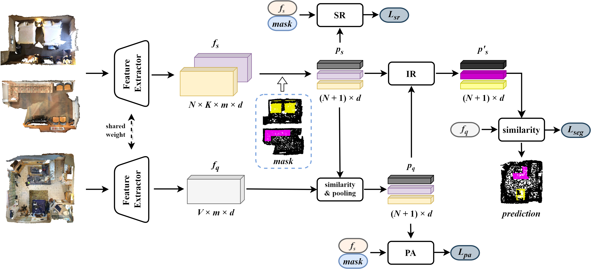

# Iterative Refinement and Alignment of Prototypes for Few-shot Point Cloud Semantic Segmentation

## Pipeline

## Running

Installation and data preparation please follow [attMPTI](https://github.com/Na-Z/attMPTI).

### Environment setup

This project is built upon the following environment:

* Python 3.8
* CUDA 11.3
* PyTorch 1.12.0

### training

First, pretrain the segmentor which includes feature extractor module on the available training set:

    cd scripts
    bash pretrain_segmentor.sh

Second, train our method:

    bash train_proto.sh

#### Evaluation

    bash eval_proto.sh

Note that the above scripts are used for 2-way 1-shot on S3DIS (S^0). You can modified the corresponding hyperparameters to conduct experiments on other settings. 

### Acknowledgment

Our implementation is mainly based on the following codebase. We gratefully thank the authors for their wonderful works.

[attMPTI](https://github.com/Na-Z/attMPTI)
[DGCNN](https://github.com/WangYueFt/dgcnn/tree/master/pytorch)
